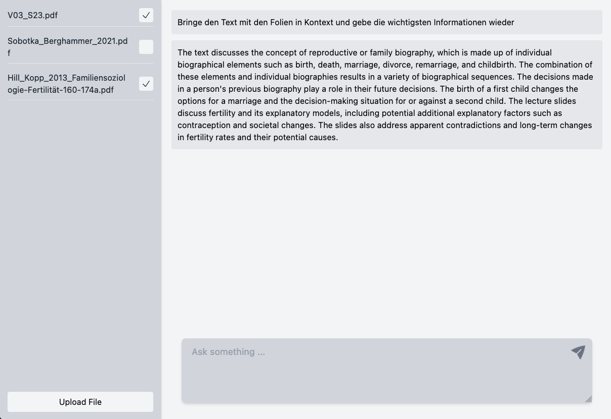

# EduChat

GPT3 & LangChain based Chatbot that allows uploading PDF documents and including them in queries.

## Local Setup

1. Clone the repository
2. Run `yarn install`
3. Install [dependencies of `pdf-extract`](https://www.npmjs.com/package/pdf-extract#installation) if you want to use OCR
4. Create a `.env.local` file containing your OpenAI API key as `OPENAI_API_KEY`
5. Run `yarn dev`
6. Open [http://localhost:3000](http://localhost:3000)
